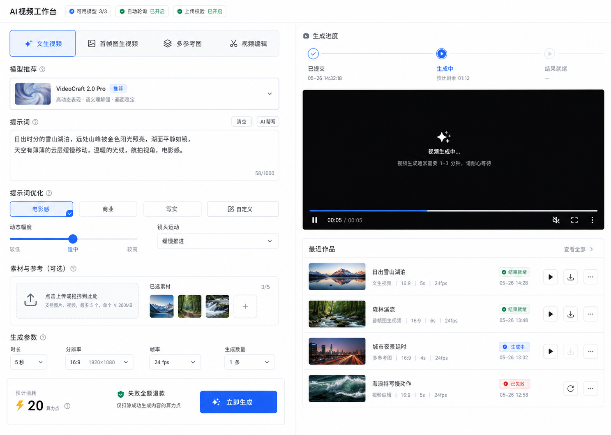
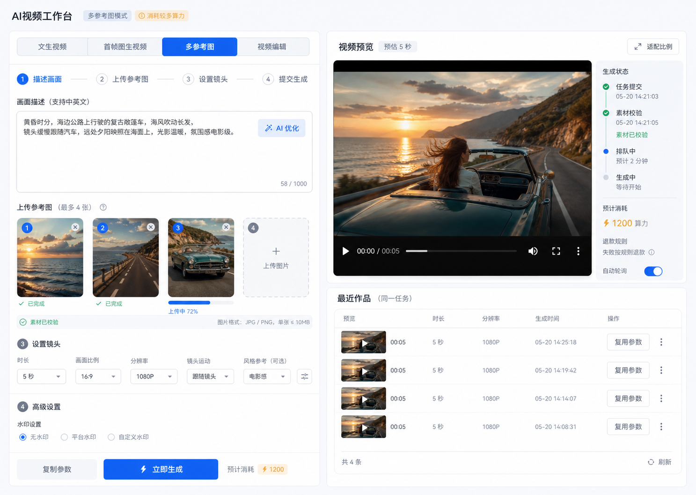
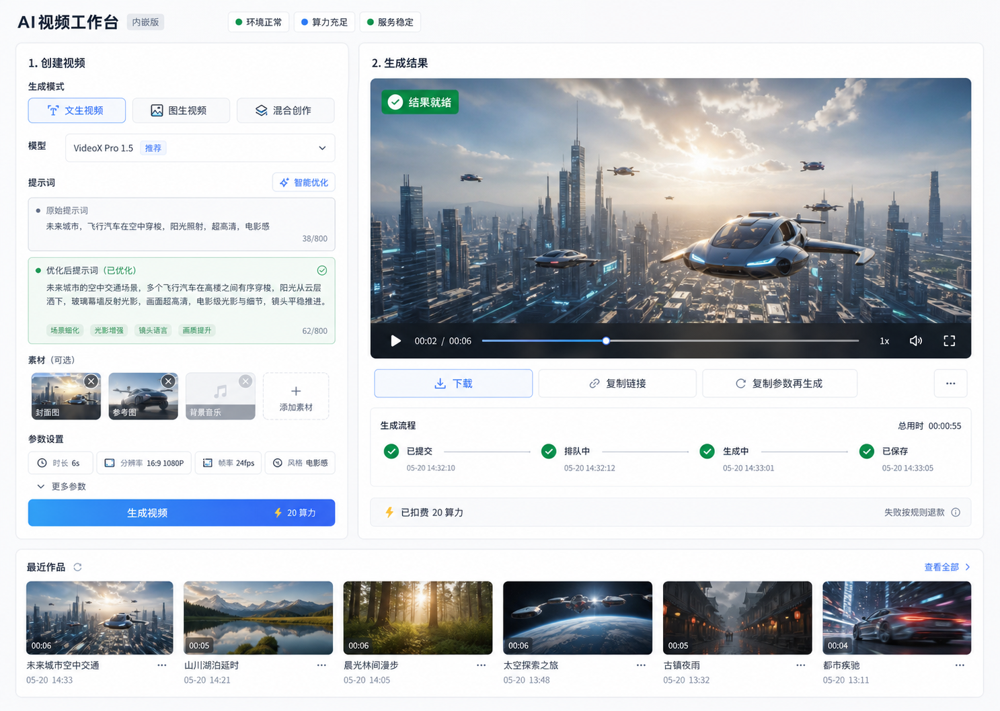

# EchoFlow 视频生成

`echoflow-video` 是 EchoFlow 的视频生成插件。当前按固定模型目录接入 Seedance、Kling、HappyHorse 等视频能力；用户端负责生成、历史和结果查看，Console 负责模型接入点、计费、模板、风控、提示词优化、Webhook 和任务运维。

文档维护规则：全仓公共边界、主系统二开、上游同步、组件化 UI 和验证规则维护在根目录 `AGENTS.md`；本 README 只维护 `echoflow-video` 的业务边界、能力状态、入口、异步生成/队列/计费/安全事实、验证命令和待办。临时分析、参考图说明、浏览器 QA checklist、外部项目快照或计划文档只作为施工材料，有效结论必须合并到 `AGENTS.md` 或本 README，不长期维护第二套插件规范；如果出现更好的队列、Secret、限流、视频协议或模型接入规范，也优先回写这两个长期入口，并从“下一步”移除已经落地的旧计划。

## 定位

| 维度 | 当前边界 |
|---|---|
| 产品形态 | 用户视频创作台 + 管理员视频运营台。 |
| 模型来源 | 插件内置固定模型 catalog，管理员不新增协议模型或供应商。 |
| 密钥来源 | 每个模型维护一组或多组主站 Secret 接入点，插件只保存引用和运行参数。 |
| 计费 | 模型级计费规则随固定模型配置维护；独立计费页不作为默认维护入口。 |
| 长流程 | 提交成功后通过主系统 `QueueModule` / BullMQ 安排自动延迟轮询，Webhook 和手动刷新走同一终态保护。 |

## 当前能力

| 能力 | 状态 | 说明 |
|---|---|---|
| 文生视频/图生视频 | ready | 根据固定模型能力收敛用户端参数和素材要求。 |
| 模型目录 | ready | Seedance、Kling、HappyHorse 等 P0 模型由 catalog 维护协议和 capability。 |
| 多接入点 | ready | 每个模型可绑定多组主站 Secret，支持优先级、超时、重试和 Base URL 覆盖。 |
| 模型级计费 | ready | 按模型基础费用、时长、分辨率倍率和失败退款配置预估与扣费。 |
| 提示词优化 | ready | 复用主站 LLM，优化扣费读取主站模型 `billingRule`。 |
| Webhook | ready | Webhook Secret 通过主站 Secret 引用，字段支持 `webhookSecret` / `secret` / `token`。 |
| 终态保护 | ready | Webhook、轮询、超时扫描和取消写回前重新加锁；已终态记录不被旧对象覆盖。 |
| 主站通知 | ready | 视频终态通知提交到主站通知中心，由平台多渠道投递。 |
| 短视频制作 | reserved | Web/Console 均保留页面入口，但当前不是默认上线能力。 |
| 真实供应商 smoke | pending | 仍需使用真实 Secret 覆盖提交、轮询、Webhook、失败退款和结果转存。 |

## 入口与页面

| 入口 | 路径 | 文件 | 职责 |
|---|---|---|---|
| Web | `/extension/echoflow-video/` | `src/web/pages/index.tsx` | 视频生成工作台。 |
| Web | `/extension/echoflow-video/history` | `src/web/pages/history.tsx` | 当前用户生成历史。 |
| Web | `/extension/echoflow-video/:id` | `src/web/pages/detail.tsx` | 当前用户任务详情。 |
| Web | `/extension/echoflow-video/studio` | `src/web/pages/studio.tsx` | 短视频制作 reserved 入口。 |
| Console | `/console/` | `src/web/pages/console/index.tsx` | 运营概览。 |
| Console | `/console/models` | `src/web/pages/console/models.tsx` | 固定模型、接入点和模型级计费。 |
| Console | `/console/policies` | `src/web/pages/console/policies.tsx` | 风控限流。 |
| Console | `/console/templates` | `src/web/pages/console/templates.tsx` | 模板预设。 |
| Console | `/console/history` | `src/web/pages/console/history.tsx` | 全量任务历史。 |
| Console | `/console/config` | `src/web/pages/console/config.tsx` | LLM 与回调 Secret。 |
| Console | `/console/studio` | `src/web/pages/console/studio.tsx` | 短视频制作 reserved 管理入口。 |

路由由 `src/web/routes.tsx` 使用 `defineRouteOption()` 注册。

## API 与后端模块

| Controller | 装饰器路径 | 说明 |
|---|---|---|
| Web generation | `@ExtensionWebController("generation")` | 创建生成、查询任务、刷新状态。 |
| Web billing | `@ExtensionWebController("billing")` | 用户端生成费用预估。 |
| Web templates | `@ExtensionWebController("templates")` | 用户端模板读取。 |
| Web webhook | `@ExtensionWebController("webhook")` | Provider 回调入口。 |
| Console generation | `@ExtensionConsoleController("generation")` | 全量任务、详情、运维操作。 |
| Console models | `@ExtensionConsoleController("models")` | 固定模型配置和接入点。 |
| Console billing-rules | `@ExtensionConsoleController("billing-rules")` | 模型计费规则。 |
| Console policies | `@ExtensionConsoleController("policies")` | 风控策略。 |
| Console templates | `@ExtensionConsoleController("templates")` | 模板管理。 |
| Console config | `@ExtensionConsoleController("config")` | 提示词优化模型与 Webhook Secret。 |

关键服务：

| 服务 | 说明 |
|---|---|
| `GenerationService` | 任务创建、余额预检、预扣、提交、轮询、Webhook 写回、退款和 public serializer。 |
| `ModelConfigService` | 固定模型 catalog、用户可见性、接入点和 capability 收敛。 |
| `ProviderConfigService` | 提示词优化模型、Webhook Secret 和配置审计。 |
| `VideoGatewayClient` | 固定视频模型的统一上游协议适配、URL 安全校验和错误归一；默认网关地址来自模型 catalog，底层 JSON 请求复用 `@buildingai/extension-sdk` provider HTTP client。 |
| `PromptOptimizationService` | 主站 LLM 提示词优化。 |
| `processors/*` | 自动延迟轮询和队列处理。 |

## 主系统复用边界

| 能力 | 当前实现 |
|---|---|
| Secret | 模型接入点和 Webhook Secret 复用主站 Secret；插件不保存业务 API Key。 |
| Webhook Secret | HappyHorse Webhook 只从主站 Secret 解析期望值，缺失或错误签名只 ACK 不写业务状态；比较使用 SHA-256 digest + `timingSafeEqual`，日志不打印 Secret 或签名值。 |
| Provider Config | 通过 `normalizeProviderConfig()` 解析 `apiKey`、`baseURL`、`webhookSecret` 等别名。 |
| Base URL | 接入点保存、测试和运行时复用 `@buildingai/extension-sdk` 的 `normalizePublicHttpUrl` / `assertPublicHttpUrl` / `normalizeProviderBaseUrl`，防止各插件重复维护公网校验。 |
| 配置输出 | Console / Web 对外返回模型、接入点或管理配置时必须白名单组装字段，不要直接展开 `config` / `resolved` / `endpoint`，避免历史字段如 `apiKeyMasked`、旧兼容键或内部排障字段泄漏。 |
| Billing | 使用 `ExtensionBillingModule` / `ExtensionBillingService` 做余额预检、预扣和失败退款；退款执行异常会写入 `rawResponse.metadata.refundError` / `refundFailedAt`，用户端只展示账务事实文案。 |
| Queue | 使用主系统 `QueueModule` / BullMQ 安排自动轮询，减少用户页轮询依赖。 |
| 模型运行保护 | 内置模型不能删除；模型有 `PENDING` / `PROCESSING` 任务时，Console 不能停用、隐藏或移除全部可用接入点，避免处理中任务失去轮询和结果写回能力。 |
| 异步写回保护 | 轮询、Webhook、超时扫描和队列失败记录写回前通过事务锁重新读取记录；若记录已终态或已软删除，不再覆盖任务状态、raw 响应或状态时间线。 |
| Upload | 素材优先通过平台上传并提交 `fileId`；后端通过 `UploadModule` / `FileUploadService` 读取平台文件记录，不直接注入平台 `File` 仓储；运行时校验上传者、插件归属、软删除、大小、MIME 和 URL；外部 URL 仍保留 SSRF 防护。 |
| Notification | 通过 `ExtensionNotificationService` 注册 `echoflow-video.generation.succeeded` / `echoflow-video.generation.failed`，由主站通知中心管理场景、模板和渠道。 |
| 构建依赖 | 已清理模板残留依赖；保留的 `@playwright/test` 只用于 e2e。依赖是否保留以是否能在源码或配置链路中找到实际用途为准。 |
| Provider HTTP | `video-http-client.ts` 只保留视频业务错误文案和薄封装；JSON 请求、timeout、retry、endpoint 测试、JSON parse 和 raw payload 压缩解析复用 `requestProviderJson` / `testProviderJsonEndpoint` / `safeJsonParse`；provider 返回的视频结果 URL 写回前复用 `assertPublicHttpUrl()` 做 DNS 解析和公网校验。 |
| 限流 | 生成和提示词优化入口使用 `ExtensionRateLimitService`，底层复用主系统 Redis 计数；不保留插件级内存 Map 或本地限流服务。 |
| 浏览器持久化 | 历史参数复用通过 `@buildingai/stores` 的 `getSessionStorage()` / `safeJsonParse()` / `safeJsonStringify()` 读写短期会话状态；插件不直接手写 `window.sessionStorage` 和 JSON 容错。 |
| Console JSON | 模板默认参数编辑器复用 `@buildingai/stores` 的 `safeJsonParse`，不在 Web 运行时代码里保留裸 `JSON.parse`。 |
| RootLayout | `main.tsx` 只挂载主系统扩展 `RootLayout`，不再重复创建 `QueryClientProvider`；页面内部缓存更新使用 `useQueryClient()` 读取宿主 query client。 |
| UI | 用户端和 Console 优先使用主系统 Button、Card、Badge、Alert、Input、Textarea、Select、Switch、Label、Checkbox、Progress、Skeleton 等组件；生成表单、Console 模型页普通字段和模板能力 checkbox 复合行均已收敛到系统 `Label`，复合行通过 `id` / `htmlFor` 保留整行点击语义；基础错误态使用系统 `Alert` / `Button` 和轻量文本符号，不在常驻路径静态引入 `lucide-react`；插件 CSS 只保留系统样式导入和无法组件化的业务排版。 |
| Manifest | `package.json` 声明运行时代码、构建配置和可运行测试资产直接 import 的包；`vite.config.ts` / `tsup.config.ts` / `eslint.config.mjs` 的 `@tailwindcss/vite`、`@vitejs/plugin-react`、`tsup`、`eslint`、`globals`，以及 `tests/e2e` 的 `@playwright/test` 不依赖根项目传递解析；`extensions/extensions.json` 的本地登记名与 `manifest.json` 保持一致。 |

## 数据与安全

| 主题 | 说明 |
|---|---|
| 任务记录 | 保存 provider、taskId、模型快照、计费快照、状态时间线、失败分类和脱敏 raw 摘要。 |
| 用户端返回 | public serializer 剥离 `taskId`、`adminRemark`、`rawRequest`、`rawResponse` 和 `billingRuleSnapshot`。 |
| 接入点 | 只保存 `secretId`、`secretName`、Base URL 覆盖、启用状态、优先级、超时和重试。 |
| Base URL 覆盖 | 保存时和运行时都拒绝本机、内网、保留地址、带凭据 URL 和非 http/https 协议；域名按 DNS 解析结果校验。 |
| URL 校验 | HappyHorse Base URL 和 provider 结果 URL 拒绝本机、内网、凭据片段和非 http/https 协议。 |
| Webhook | 未配置 Secret 时不信任公开回调；配置后校验主站 Secret 字段。 |
| 删除保护 | 模型已有任务、计费、策略或模板引用时应停用而不是删除。 |

## 配置流程

1. 在主站密钥管理创建视频服务 Secret，字段包含 `apiKey` 或 `api_key`，可选 `baseURL` / `baseUrl` / `base_url`。
2. 在 Console `/models` 为固定模型绑定一组或多组 Secret 接入点，配置用户可见性、默认参数、模型级计费、超时、重试和优先级。
3. 在 `/config` 选择提示词优化 LLM，并绑定 Webhook Secret。
4. 在 `/policies` 配置 prompt、素材、并发、用户/IP/provider/model 等风控策略。
5. 使用 `/history` 和任务详情复核提交、轮询、Webhook、失败退款、通知和状态时间线。

## 开发与验证

```bash
pnpm --filter echoflow-video check-types
pnpm --filter echoflow-video build:api
pnpm --filter echoflow-video build:web
pnpm --filter echoflow-video test
pnpm --filter echoflow-video build:publish
```

当前验证缺口：

| 项目 | 状态 |
|---|---|
| 类型检查与单测 | package 脚本直接执行 `vue-tsc --noEmit` 和 Jest 入口，避免 Windows/Corepack 嵌套 `pnpm run` 版本 shim 问题；测试桩需保持主系统 SDK 导出同步。 |
| Web 构建 | 本机曾复现 Vite/Rolldown HTML entry 解析问题；当前已通过 `build:web` 和 `build:publish` 回归验证。 |
| 真实端到端 | 需要真实主站 Secret 覆盖 Seedance、Kling、HappyHorse P0 模型提交、轮询、Webhook、失败退款和结果转存。 |
| Redis/Worker | 需要 smoke 自动延迟轮询、多实例重启恢复、超时扫描和终态短路。 |
| 主系统安装 | 发布包真实安装未完成；Docker `postgres` / `redis` / `nodejs` 当前均为 healthy，`@buildingai/llm-file-parser` Docker 解析阻塞已通过 workspace 包 `node_modules` anonymous volume 隔离修复；日志显示 `echoflow-video` Loaded extension。当前 `http://127.0.0.1:4090` 请求仍被主系统启动链路阻塞：`WechatModule` 缺 `DictRepository` 注入，同时 `echoflow-ai-town` build 缺 `town-ai-rules.mjs`。 |

## 用户端前端优化规划

用户端首页应保持嵌入式业务面板形态，而不是完整应用壳。主系统已经提供全局导航、账号、登录、主题、余额入口、通知和页面外层布局，插件内部只展示当前视频生成所需的业务上下文：生成方式、素材要求、提示词、扣费与失败退款说明、任务状态、结果操作和最近作品。

视觉气质要有现代 AI 工具感，避免传统后台表单气质。现代感不靠大面积炫光、营销 Hero 或完整应用外壳，而是落在智能引导、轻量层次、状态可视化、结果预览和细腻交互反馈上。

| 方向 | 设计要求 | 开发落点 |
|---|---|---|
| 插件边界 | 不做营销 Hero、独立侧边栏、用户中心、头像账号、全局余额或通知设置。 | `src/web/pages/index.tsx` 保持紧凑工作台；避免固定整页大壳和过宽容器。 |
| 生成方式优先 | 用户先选 `文生视频`、`首帧图生视频`、`多参考图`、`视频编辑`，再由系统推荐/过滤兼容模型。 | 从 `VideoModelOption.capabilities.abilityTypes` 派生可用模式，继续提交真实 `CreateVideoParams.model`。 |
| 动态素材槽 | 不再让用户泛泛“添加媒体”；不同模式展示明确素材槽。 | `GenerationForm` 中按模式生成首帧图、参考图、视频素材槽，继续使用平台 `uploadFileAuto()` 和 `fileId`。 |
| 提示词优化 | 优化按钮要表现为可控步骤，展示风格、来源和必要扣费结果。 | 复用 `useWebOptimizePromptMutation`，保留原始 prompt 和优化来源，不暴露全局模型运维术语。 |
| 扣费与信任 | 提交前靠近按钮展示预计算力、失败退款规则、平台上传校验和自动轮询。 | 使用 Web 计费预估与 `VideoGeneration.billingStatus`，不展示全局余额、不硬编码真实价格。 |
| 结果迭代 | 右侧结果面板成为当前任务的工作记忆。 | `VideoResult` 增强空态、处理中 timeline、成功下载/复制/复用、失败重试和账务状态。 |
| 历史复用 | 最近作品用于继续生成，不做独立作品集。 | `HistoryList` 展示缩略图、状态、模式/模型、账务、时间，并保留详情和复用路径。 |
| reserved 能力 | `短视频制作` 当前仍是预留能力，不能作为默认主行动。 | 首页弱化或移除主按钮；`studio` 页面保留 reserved 文案。 |

现代感表达：

| 设计层 | 建议 | 避免 |
|---|---|---|
| 头部 | 紧凑标题 + 轻量状态 chips，例如可用模型、自动轮询、上传校验。 | 大 Hero、营销口号、重复主系统导航。 |
| 模式选择 | 用分段卡片/segmented control 表达 4 种生成意图，当前模式有清晰选中态和能力提示。 | 只用传统下拉框让用户先猜模型。 |
| 提示词区 | 文案像 AI 创作助手：支持优化风格、保留原始描述、显示优化来源。 | 空泛 “AI 加持”“一键智能” 文案堆叠。 |
| 素材区 | 图片/视频槽有预览、上传进度、文件类型提示和错误态；素材槽随模式变化。 | 传统附件列表、无预览、只显示 URL。 |
| 结果区 | 黑色视频预览面、生成中 timeline、进度和状态脉冲，完成后突出播放与再生成。 | 只用纯文字 loading 或后台式状态表。 |
| 色彩与层次 | 以主系统主题为底，局部使用柔和高亮、浅色渐变边框或半透明状态底。 | 大面积紫蓝渐变、发光球、独立暗黑大屏。 |
| 动效 | 上传、轮询、优化、生成中使用轻量过渡和 skeleton；动效只服务状态理解。 | 持续强动画、干扰输入、影响嵌入页性能。 |
| 排版 | 左输入右结果，信息密度高但留白清楚；移动端单任务流。 | 过大标题、过宽居中容器、卡片套卡片。 |

设计示意图只作为布局、信息层级和现代感参考，不照搬其中的第三方模型名、示例算力数字、日期、品牌名或虚构素材；实现仍以插件固定模型目录、Console 配置和 Web public 字段为准。

| 参考图 | 适合参考的重点 |
|---|---|
|  | 首屏模式选择、左输入右结果、提交前算力/退款/校验提示、生成中预览和最近作品。 |
|  | 多参考图素材槽、上传进度、分步素材校验、右侧状态 timeline 和最近任务复用。 |
|  | 结果区优先级、播放/下载/复制/复用操作、生成流程 timeline 和底部最近作品条。 |

本轮返工以 `video-workbench-result-led.png` 作为主视觉目标：左侧是紧凑创建面板，右侧是大结果画布，底部是横向最近作品。`video-workbench-mode-first.png` 只作为模式 tab、模型推荐、扣费/退款提示参考；`video-workbench-material-flow.png` 只作为多参考图素材槽、上传校验和状态 timeline 参考。不得再新增第四套布局方向。

建议开发顺序：

| 优先级 | 范围 | 文件 | 完成条件 |
|---|---|---|---|
| P1 | 工作台 UX 重构 | `src/web/pages/index.tsx`、`src/web/components/generation-form.tsx`、`src/web/components/video-result.tsx`、`src/web/styles/index.css`、`src/web/pages/studio.tsx` | 支持模式优先、动态素材槽、提交信任区、结果 timeline，整体呈现现代 AI 工具感，且 `短视频制作` 不再像已上线主功能。 |
| P2 | 历史和详情打磨 | `src/web/components/history-list.tsx`、`src/web/pages/history.tsx`、`src/web/pages/detail.tsx` | 历史更适合复用生成参数，详情页与结果面板状态/账务文案一致。 |
| P3 | 响应式与视觉 QA | 用户端触达的 Web 组件和插件 CSS | 桌面/移动端无重叠、无截断、无嵌套卡片堆叠，不覆盖主系统组件主题。 |

模式与素材映射：

| 模式 | capability | 素材 |
|---|---|---|
| 文生视频 | `text_to_video` | 不需要素材。 |
| 首帧图生视频 | `first_frame_i2v` | 需要且只需要 1 张 `first_frame` 图片。 |
| 多参考图 | `reference_to_video` | 需要 1-4 张 `reference_image` 图片。 |
| 视频编辑 | `video_editing` / `action_transfer` | 需要 1 个 `video`，可按模型能力追加参考图。 |

P1 验收时至少覆盖：无模型配置、文生视频无素材提交、首帧图上传、多参考图数量限制、视频编辑素材校验、错误 MIME 拦截、提示词优化成功/本地 fallback、处理中/成功/失败结果态、失败退款账务展示和参数复用。

## 用户端前端完整开发任务拆解

本轮开发范围聚焦 Web 用户端体验优化。默认不新增后端字段、不改主系统、不改变计费和上传真实边界；除非实现过程中发现 Web public 字段不足，否则只在 `extensions/echoflow-video/src/web/` 和插件 README/静态参考图内收口。

### P0：开发前收口

| 任务 | 文件 | 要点 | 验收 |
|---|---|---|---|
| 复核 dirty worktree | 仓库根目录 | 开发前再次查看 `git status --short --branch`，只处理 `echoflow-video` 用户端相关文件。 | 不回滚非本任务改动，不混入其他插件。 |
| 固定设计目标 | `README.md` | 以三张示意图为视觉参考，结合第 3 张结果区、第 1 张模式选择、第 2 张素材槽。 | 设计方向清楚，不再新增独立设计文档。 |
| 明确字段边界 | `src/web/services/types/generation.ts` | 只使用 `VideoModelOption`、`VideoGeneration`、`CreateVideoParams` 已有 public 字段。 | Web 不出现 `secretId`、Base URL、taskId、raw response、admin note。 |
| 规划轻量工具层 | `src/web/lib/*` | 先提取 mode/label/format helper，避免把 `generation-form.tsx` 继续胀大。 | helper 只处理前端展示和校验，不改 API 契约。 |

### P1：工作台首屏重构

| 任务 | 文件 | 具体改动 | 依赖 | 验收 |
|---|---|---|---|---|
| 模式能力 helper | `src/web/lib/video-mode.ts` | 定义 `VideoGenerationMode`，映射 `text_to_video`、`first_frame_i2v`、`reference_to_video`、`video_editing/action_transfer`；提供 `getModeOptions(models)`、`getCompatibleModels(mode, models)`、`inferModeFromMedia()`、`getMaterialSlots(mode, model)`。 | `VideoModelOption.capabilities.abilityTypes`、`mediaTypes`。 | 模式可用性完全来自 Console 配置后的模型列表，不硬编码供应商上线状态。 |
| 公共标签 helper | `src/web/lib/video-labels.ts` | 统一状态、账务、素材、模式、prompt 优化来源文案。 | `VideoGenerationStatus`、`VideoGenerationBillingStatus`。 | `VideoResult`、`HistoryList`、`detail.tsx` 文案一致。 |
| 首页嵌入式外壳 | `src/web/pages/index.tsx` | 去掉独立应用感的 `min-h-screen` 大壳倾向，改成紧凑工作台；状态 chips 展示可用模型、自动轮询、上传校验；`短视频制作` 从主行动降级为 reserved 链接或隐藏。 | 当前主系统 iframe/RootLayout 已提供外壳。 | 首屏不是营销 Hero，不重复导航/账号/余额，reserved 能力不被误认为已上线。 |
| 首页历史加载 | `src/web/pages/index.tsx` | 当前 `useWebVideoListQuery(..., { enabled: false })` 会让最近作品不加载；改成默认加载最近 6 条或按有权限时加载。 | Web history API。 | 首页最近作品可见，失败时不阻断生成表单。 |
| 表单模式优先 | `src/web/components/generation-form.tsx` | 模型下拉前增加 4 模式选择；切换模式后自动选择第一个兼容模型或保留兼容的当前模型；不兼容模式显示禁用说明。 | `video-mode.ts`。 | 用户先理解生成意图，再选择模型。 |
| 模型推荐 | `generation-form.tsx` | 模型选择只显示当前模式兼容项，展示 `model.name`、description、默认参数；支持模型为空态。 | `getCompatibleModels()`。 | 不会选择到不支持当前素材要求的模型。 |
| 动态素材槽 | `generation-form.tsx`，必要时 `components/material-slots.tsx` | 用模式生成槽位：文生无素材、首帧 1 张、多参考图 1-4 张、视频编辑 1 个视频 + 可选参考图；保留预览、上传中、错误、重新上传状态。 | `uploadFileAuto()`、`VideoMediaItem`。 | 不再出现泛泛“添加媒体”；提交前素材数量和类型正确。 |
| 历史素材回填保护 | `generation-form.tsx` | 复用历史参数时，有 URL 但无 `fileId` 的素材显示“需重新上传”，不能直接提交。 | 现有 `mediaIssue` 逻辑。 | 历史外链不会绕过平台上传归属校验。 |
| Prompt 优化现代化 | `generation-form.tsx` | 优化区改成轻量 AI 创作助手：风格、优化模型、来源、原始描述/优化后对比；`AI 优化` 不使用泛化营销文案。 | `useWebOptimizePromptMutation`。 | 成功、失败、本地 fallback 都有明确反馈；不暴露 provider 运维术语。 |
| 参数区收敛 | `generation-form.tsx` | duration/resolution/ratio/watermark 按模型 capability 展示，移动端布局不挤压；`audioSetting` 如暂未有真实 UI，不新增假控制。 | `selectedModel.capabilities`。 | 参数不会越过模型能力范围。 |
| 提交信任区 | `generation-form.tsx` | 按按钮附近展示预计算力、失败按规则退款、平台上传校验、自动轮询；移除或弱化本地 `estimatePower()` 的硬编码模型倍率 fallback，估算失败时显示“按配置预估中”。 | `useWebEstimateVideoBillingMutation`。 | 前端不硬编码真实价格，不展示全局余额。 |
| 结果面板升级 | `src/web/components/video-result.tsx` | 空态、提交中 skeleton、处理中 preview well、progress、`statusEvents` timeline、成功播放/下载/复制/复制参数、失败错误/账务/重试。 | `VideoGeneration.statusEvents`、`progress`、`billingStatus`、`billingAmount`。 | 右侧成为当前任务工作记忆，而不是简单状态卡。 |
| 组件化视觉实现 | `src/web/pages/index.tsx`、`src/web/components/*.tsx`、`src/web/styles/index.css` | 优先使用 `@buildingai/ui` 的 Card、Button、Badge、Alert、Input、Textarea、Select、Switch、Label、Progress、Skeleton；普通字段不使用裸 `label/span` 重写标签样式，插件 CSS 只保留系统样式导入。 | 主系统 UI 组件和主题变量。 | 嵌入主系统的现代工具感，不再维护大段 `ev-*` 手写样式。 |

P1 完成后应能从首页覆盖完整生成闭环：选择模式、选择模型、输入/优化 prompt、上传必要素材、看到扣费与退款提示、提交任务、查看轮询状态、成功后播放/复制/复用，失败后看到错误和账务状态。

### 本轮落地状态

| 范围 | 状态 | 已落地文件 | 说明 |
|---|---|---|---|
| 模式和素材逻辑 | 已落地 | `src/web/lib/video-mode.ts`、`src/web/lib/video-labels.ts`、`src/web/components/generation-form.tsx` | 模式优先、兼容模型过滤、动态素材槽和历史回填保护已接入。 |
| 首屏视觉实现 | 已返工 | `src/web/pages/index.tsx`、`src/web/styles/index.css` | 删除旧的 `ev-*` 手写样式，改用主系统 UI 组件和工具类；桌面为左创作、右结果、底部最近生成。 |
| 结果区 | 已返工 | `src/web/components/video-result.tsx` | 使用 Card、Badge、Progress、Alert、Button 组合呈现视频画布、异步状态、流程 timeline 和账务条。 |
| 历史区 | 已返工 | `src/web/components/history-list.tsx`、`src/web/pages/history.tsx`、`src/web/pages/detail.tsx` | 首页支持横向最近生成条；历史/详情/studio 子页使用普通嵌入式容器，不再依赖插件专属外壳样式。 |
| 首屏接口降级 | 已落地 | `src/web/services/web/generation.ts`、`src/web/services/web/templates.ts` | 模型、模板和最近记录读取失败时静默空态，不在 standalone Vite 首屏弹出网络错误 toast；主动提交/刷新/优化仍保留错误提示。 |
| 边界测试 | 已补强 | `tests/api/modules/generation/services/video-rate-limit-sdk-boundary.test.mjs`、`tests/video-public-api-boundary.test.mjs`、`tests/api/modules/generation/services/prompt-optimization.service.spec.ts` | 限流边界约束使用 SDK `ExtensionRateLimitService`；public API 边界测试约束 Web public 字段、Web/Console client 分离、常驻错误态不静态引入 `lucide-react` 和用户端动作使用系统 Button。 |

返工验收以浏览器截图为准，不能仅用构建或单测通过声明完成。本轮组件化返工后需重新检查桌面和移动端：无旧 `ev-*` 手写样式残留、无横向溢出、无 console error/warn；无后端 API 时首屏应进入安静空态。

### 参考图驱动返工任务

| 任务 | 文件 | 具体要求 | 验收证据 |
|---|---|---|---|
| 清理乱样式 | `src/web/styles/index.css` | 删除大段自定义 CSS，保留 `@buildingai/ui` 样式导入。 | CSS 中不再出现成批 utility mirror 或 `ev-*` 专属样式，页面由系统组件承接。 |
| 使用组件 tokens | `src/web/components/*.tsx` | 用主系统 Card、Badge、Progress、Alert、Button、Input、Select 等组件表达面板、状态、进度、素材槽和操作。 | 不再新增插件级设计 token，颜色、圆角、焦点态跟随主系统。 |
| 重做首页骨架 | `src/web/pages/index.tsx` | 采用第 3 张布局：顶部状态条、左侧创建面板、右侧大结果画布、底部横向最近作品；不再是两个普通 Card 堆叠。 | 首屏 1280px 宽截图中右侧结果区是视觉中心。 |
| 重做创建面板 | `src/web/components/generation-form.tsx` | 模式 tab 参考第 1 张；prompt 原始/优化区、素材缩略槽、参数 chips、算力/退款和主按钮参考第 3 张。 | 无模型状态也保持完整结构，不出现裸控件或错位。 |
| 重做素材槽 | `generation-form.tsx`、`styles/index.css` | 多参考图模式参考第 2 张：缩略图卡、序号、上传/已完成/错误状态、增加槽。 | 浏览器中切换/回填素材时槽位稳定，不撑破布局。 |
| 重做结果画布 | `src/web/components/video-result.tsx` | 大视频区域、顶部状态 badge、下载/复制/复用操作条、流程 timeline、账务条参考第 3 张。 | 空态、处理中、成功、失败四态截图结构一致。 |
| 重做最近作品 | `src/web/components/history-list.tsx` | 首页 variant 改为横向作品条，缩略图上显示时长，标题/时间/更多操作在下方。 | 首页底部横向作品条，不再像后台列表。 |
| 用户端子页收敛 | `src/web/pages/history.tsx`、`src/web/pages/detail.tsx`、`src/web/pages/studio.tsx` | 历史和详情保留插件面板感，reserved 页面继续弱化；不得出现独立 App 壳。 | 浏览器打开 history/detail/studio 无 `min-h-screen` 独立应用感。 |
| 浏览器 QA | Browser 插件 | 检查当前 tab、桌面 1280 宽、移动 390 宽、模板填充、无模型禁用、无横向溢出、无 console error。 | 截图与三张参考图逐项对比，未达标继续修。 |

### P2：历史、详情与复用闭环

| 任务 | 文件 | 具体改动 | 依赖 | 验收 |
|---|---|---|---|---|
| 最近作品组件模式 | 已落地：`src/web/components/history-list.tsx` | 支持 `variant="compact" | "full" | "strip"`；首页 `strip` 是横向作品条，历史页保留完整筛选列表。 | 当前 `HistoryList`。 | 首页不变成独立作品集，历史页信息仍完整。 |
| 模式标签推断 | 已落地：`history-list.tsx`、`video-labels.ts`、`video-mode.ts` | 从 `generation.media` 和 `generation.model` 推断展示 `文生视频/首帧图生视频/多参考图/视频编辑`。 | `inferModeFromMedia()`。 | 不再只依赖 HappyHorse 硬编码 model label。 |
| 参数复用入口 | 已落地：`history-list.tsx`、`index.tsx` | 首页最近作品条提供 `复用` 按钮，通过 `onReuse` 直接回填当前工作台；历史页/详情页继续走 `writeReuseParams()` 返回工作台。 | `reuse-params-storage.ts`、首页 `handleReuse`。 | 用户能从最近作品快速继续生成；当前页无需刷新也能回填。 |
| 历史筛选去硬编码 | 已落地：`src/web/pages/history.tsx` | 模型筛选读取 `useWebVideoModelOptionsQuery()` 生成可选模型。 | Web model options API。 | Console 改模型可见性后，用户端筛选随配置变化；边界测试禁止 Seedance/Kling/HappyHorse 硬编码回流。 |
| 详情页统一状态语言 | 已落地：`src/web/pages/detail.tsx` | 复用 `video-labels.ts` 和 timeline 展示；结果播放、账务、失败、素材、参数与 `VideoResult` 保持一致。 | `video-labels.ts`。 | 首页结果页和详情页体验一致。 |
| 详情页素材预览 | 已落地：`src/web/pages/detail.tsx` | 素材展示缩略预览、文件信息和“查看素材”外链；外链只作为查看入口，不暗示可直接复用提交。 | `VideoMediaItem`。 | 用户看得懂生成依据，安全边界不变。 |

### P3：状态、空态与异常路径

| 场景 | 文件 | 要求 |
|---|---|---|
| 无模型配置 | `index.tsx`、`generation-form.tsx` | 表单整体只读，输入、模板、上传、参数和提交控件全部禁用；展示功能暂未开放，不显示假模型数量。 |
| 模式无兼容模型 | 已落地：`generation-form.tsx` | 模式可见但无兼容模型时展示“当前模式暂无可用模型”，提示到 Console 启用支持该生成方式的视频模型；用户端保留工作台但不能提交该模式任务。 |
| 计费预估失败 | 已落地：`generation-form.tsx` | 不使用硬编码价格伪装真实结果；区分“预估中 / 预估暂不可用 / 按配置预估”，预估失败时说明提交仍以后端计费规则为准。 |
| 上传错误 | 已落地：`generation-form.tsx` | MIME、上传失败、历史素材需重传分别给出短文案；真实大小限制仍以后端平台上传校验为准。 |
| 生成中超长等待 | 已落地：`VideoResult` | timeline、自动轮询和处理中画布文案保持稳定，明确生成较久无需重复提交，可保持页面或稍后从历史查看，不制造重复 toast。 |
| 成功但无视频 URL | 已落地：`VideoResult`、`detail.tsx` | 明确“任务完成但未返回视频地址”，提示稍后刷新，不暴露 provider 细节；详情页不再把该状态误写成“视频生成中”。 |
| 失败且已退款 | 已落地：`VideoResult`、`HistoryList`、`detail.tsx`、`video-labels.ts` | 失败态按 public `billingStatus` 展示“已按账务事实退款 / 等待退款核对 / 扣费或退款异常”等用户可理解文案，不写超出账务事实的闭环承诺。 |
| 移动端长文本 | 已落地：`generation-form.tsx`、`history-list.tsx`、`detail.tsx`、`video-result.tsx` | 长 prompt、长模型名、长文件名和状态消息使用 `truncate`、`line-clamp`、`break-words`、`min-w-0` 等工具类，不挤压按钮或撑破详情面板。 |

### P4：验证与视觉 QA

| 类型 | 命令或方式 | 验收 |
|---|---|---|
| 类型检查 | `corepack pnpm --filter echoflow-video check-types` | 已通过。 |
| Web 构建 | `corepack pnpm --filter echoflow-video build:web` | 已通过；路由懒加载、插件级错误兜底、Web 状态查询静默化和去除重复 query client 后主入口 `index-CckzAClT.js` 433.96 kB / gzip 134.09 kB，CSS `index-BuxW2bux.css` 406.09 kB / gzip 58.71 kB，历史、详情、模型、模板等页面拆成独立 chunks，已消除本插件此前的 Vite 主 chunk 超过 500 kB 警告。 |
| API 构建 | `corepack pnpm --filter echoflow-video build:api` | 已通过；产物覆盖 Webhook controller、轮询 processor、0.0.1 upgrade、Web/Console controller 和模型/计费/模板/provider service。 |
| 发布构建 | `corepack pnpm --filter echoflow-video build:publish` | 已通过；Vite Web 构建和 tsup API 构建连续成功，`.output/public/index.html`、拆分 chunks 与 `build/index.js` 均生成；脚本已避免嵌套 `pnpm run` 在 Windows/Corepack 下触发版本 shim 问题。最近复测生成 `assets/index-CckzAClT.js` / `assets/index-BuxW2bux.css`，API 产物覆盖 `build/index.js`、`build/modules/*`、`build/db/*` 与 `build/upgrade/0.0.1/index.js`。 |
| Release zip | `pnpm extension:release` | 已通过本地交互式打包；生成 `releases/echoflow-video-0.0.1.zip`，大小 6,956,025 bytes，247 entries；zip 内包含 `.output/public/index.html`、`build/index.js`、`manifest.json`、`package.json`、`README.md`、`storage/static/logo.png` 和三张 `storage/static/design` 参考图；未包含 `storage/uploads`、`tests` 或 `node_modules`。 |
| 包级测试 | `corepack pnpm --filter echoflow-video test` | 已通过，6 suites / 51 tests；脚本直接执行 `vue-tsc --noEmit` 和 Jest 入口，测试替身已同步 `resolveProviderSecretValue`、`normalizeProviderBaseUrl`、`requestProviderJson`、`testProviderJsonEndpoint` 和 TypeORM `In`；`GenerationService` 行为测试覆盖他人 `fileId`、软删除上传文件、错误 MIME 和超限文件在计费/提交供应商前被拦截。最近复测时间为 2026-06-20。 |
| Manifest/发布边界 | `node tests\\video-manifest-boundary.test.mjs` | 已通过，10 tests；覆盖 manifest/package/extensions registry 版本一致、直接 import 依赖声明、发布脚本包含 Web/API 构建、`.output/public/index.html`、`build/index.js`、`storage/static/logo.png` 和三张设计参考图存在、release CLI 白名单包含发布必需路径且不携带 `node_modules`、运行时上传或测试目录、主系统升级保留 `data` 与 `storage` 整目录、README 记录当前 4090 主系统安装阻塞、主站上传服务边界、旧 HappyHorse-only 客户端退役和复用参数存储使用 `@buildingai/stores`。 |
| Public 边界 | `node tests\\video-public-api-boundary.test.mjs` | 已通过，35 tests；覆盖 Web/Console public 边界、详情/状态查询静默失败、详情页素材查看边界、用户端页面不暴露供应商/Secret/Webhook/taskId/rawResponse 等运维术语、用户端页面标题与正文业务命名一致、详情页移动端长文本防溢出、模式无兼容模型提示、无可用 public 模型时生成控件整体禁用、生成中长等待说明、系统 Button、常驻错误态不静态引入 `lucide-react`、计费预估失败文案、最近作品直接复用、历史模型筛选 public 配置化、成功无视频地址说明、失败退款信任文案、退款失败 metadata 持久化、异步写回跳过软删除记录、provider 结果 URL DNS 公网校验、Webhook Secret 常量时间校验和日志脱敏、Console 嵌入容器、Console JSON 安全解析、模板能力复合行使用系统 `Label` / `Checkbox`、路由懒加载、插件级错误兜底、路由常驻模块不静态引入 `lucide-react`、RootLayout 承接 query client、SDK 限流、provider HTTP SDK、低层 AI SDK 禁用、插件表单字段 `Label` 复用边界和 Vite 白屏根因回归。 |
| 本地 HTTP smoke | `Invoke-WebRequest http://127.0.0.1:5185/extension/echoflow-video` 与入口 JS | 已通过；Vite dev server 返回 HTML 200，当前构建入口 JS 返回 200。 |
| 浏览器检查 | Browser/IAB + Vite `5187` | 已通过用户端当前页复测；桌面 `http://127.0.0.1:5187/extension/echoflow-video` 标题为“视频生成”，等待业务内容出现后无页面级横向溢出、无 console error/warn；无可提交规格状态下生成输入、模式、模板、上传、参数和提交控件均禁用，只保留“查看全部”等非生成入口；异步生成、失败退款和历史入口文案可见；移动 390px 级宽度等待业务标题出现后无横向溢出、无 console error/warn。当前本地无历史数据，最近作品 `复用` 按钮实例由边界测试和构建验证覆盖。 |
| Console 静态检查 | `ConsolePage` + `node tests\\video-public-api-boundary.test.mjs` + `build:web` | Console 8 个管理页已统一使用嵌入式 `ConsolePage`，不再出现 `min-h-screen`、`h-screen` 或 `100vh` 完整应用壳；本轮 Browser/IAB 因安全策略拒绝访问 `/console/` URL，未声明 Console 浏览器通过。 |
| 懒加载与 RootLayout 后浏览器复测 | Browser/IAB + Vite `5187` | 已通过 fresh tab 复测；React lazy route 会短暂显示 skeleton，验收必须等待业务标题和关键文案出现后再判断。当前 `视频生成` 首屏、异步生成说明、无可提交规格只读态和最近生成空态均可见。 |
| 手动场景 | 首页生成、历史、详情、reserved `studio` | 首页首屏、空模型、提示词模板、最近生成空态、历史空态、详情任务不可读兜底和 reserved 页面已覆盖；Browser/IAB 已复测历史页标题/正文一致、无横向溢出、无 console error/warn，`studio` 子页无横向溢出、无 console error/warn，且不暴露供应商/运维术语；真实供应商调用、真实退款、Webhook 和队列恢复仍归端到端 smoke。 |

本轮浏览器发现的白屏根因是 dev server 解析插件根 `tsconfig.json` 后继续读取 API tsconfig，已通过 `vite.config.ts` 禁用 native tsconfig paths 并补回归测试。若只需要临时前端预览，可在插件目录用 Vite 直启并带上 pnpm hoist 路径：`$env:NODE_PATH=(Resolve-Path ..\\..\\node_modules\\.pnpm\\node_modules).Path; node ..\\..\\node_modules\\.pnpm\\vite@8.0.0_@types+node@25.5_e06394327d78b07ae273c24eda0f347c\\node_modules\\vite\\bin\\vite.js --host 127.0.0.1 --port 5181`。当前 5181 被占用时 Vite 会自动切到 5182。

插件 Web 自有的模型、模板、历史、详情、provider 状态、状态轮询和刷新查询默认使用静默请求或业务空态兜底，避免主站 API 暂不可达时刷全局错误 toast；登录态失效或未登录时跳转登录仍由 `@buildingai/services` 的插件 HTTP client 统一处理，插件不覆盖主系统认证流程。

无可用视频模型时，用户端保留工作台结构、异步生成、失败退款和上传校验说明，但生成表单进入整体只读状态：用户不能继续输入 prompt、套模板、改参数、上传素材或提交任务，避免“暂未开放但仍可填写”的错觉。

用户端“复制参数再生成”只保存短期复用参数，使用主系统 `@buildingai/stores` 的 `getSessionStorage`、`safeJsonParse` 和 `safeJsonStringify`，不在插件内直接操作 `window.sessionStorage` 或手写 JSON parse/stringify。

### 不在本轮前端优化里做

| 不做 | 原因 |
|---|---|
| 新增用户中心、头像、登录、余额中心、通知偏好 | 主系统已有，插件重复会割裂宿主体验。 |
| 把 `短视频制作` 做成默认主流程 | 当前是 reserved 能力，不能呈现为已上线。 |
| 新增 Web 可见 provider/Secret/Base URL/taskId/raw response | 违反 Web public serializer 边界。 |
| 手工新增用户侧模型或供应商 | 插件模型来自固定 catalog + Console 配置。 |
| 大面积重写主系统 UI 主题 | 插件 CSS 只负责业务布局和状态，不覆盖系统组件主题。 |
| 声称真实外部模型、Webhook、失败退款已完全闭环 | 需要真实 Secret、余额、存储和队列 smoke 后才能确认。 |

## 已知风险

| 风险 | 影响 | 下一步 |
|---|---|---|
| 真实供应商未 smoke | 当前不能声明完整生产闭环。 | 准备 Secret、余额、存储和测试素材后逐模型验证。 |
| 短视频制作 reserved | 页面存在但不是上线能力。 | 保持 reserved 文案和禁用路径，避免误导用户。 |
| 共享依赖包体仍需观察 | 当前主入口 JS `index-CckzAClT.js` 约 433.96 kB；仍有 `card-DhRONJdI.js` 约 178.65 kB、CSS `index-BuxW2bux.css` 约 406.09 kB。 | 后续结合主系统组件库与 Tailwind 输出做共享依赖/样式体积审查。 |
| 多供应商扩展 | 非 HappyHorse 供应商适配仍需逐协议验证。 | 新 provider 接入前补协议 capability、URL 安全和状态映射测试。 |
| 队列拓扑 | 真实 Redis/Worker 未覆盖时，自动轮询可靠性不能下结论。 | 做重启恢复、重复入队、超时和终态竞态 smoke。 |
| 真实上传边界 | 前端已提示素材类型、上传失败和历史素材需重传；后端行为测试已覆盖他人 `fileId`、软删除上传文件、错误 MIME 和超限文件拦截。真实平台上传记录创建、存储访问和历史素材重传仍需端到端 smoke。 | 端到端 smoke 时覆盖真实上传记录归属、存储访问、历史素材重传和任务写回。 |
| 主系统安装未完成 | release zip 已通过本地内容检查；Docker 三件套已 healthy，`echoflow-video` 已被主系统加载，但 4090 请求仍因主系统启动链路异常中断，不能声明 Console/API 安装、migration/upgrade、服务重启和页面打开闭环。 | 先修复 `WechatModule` 的 `DictRepository` 注入和 `echoflow-ai-town` 缺 `town-ai-rules.mjs` 构建产物，再通过主系统安装 release zip 并复测 Web/Console/Worker。 |

## 后续完整开发任务

后续开发按“真实链路优先、发布可安装、再做体验细节”的顺序推进。每个阶段完成后把新证据更新到本 README；若发现跨插件通用规范，再同步更新根目录 `AGENTS.md`，不另起长期文档。

### P1：真实端到端 smoke

| 任务 | 范围 | 具体步骤 | 验收 |
|---|---|---|---|
| 配置真实运行环境 | 主站 Console、Secret、测试用户、余额、Redis、存储 | 准备视频服务 Secret、Webhook Secret、测试用户余额、平台上传目录和 Redis Worker；确认 `echoflow-video` 已安装且 Console 可打开。 | 记录环境条件；缺 Secret、余额或 Redis 时不进入真实闭环验收。 |
| 文生视频提交 | Web 工作台、`GenerationService`、provider client | 用一个 P0 文生模型提交 prompt，确认创建记录、预扣、入队、provider 返回 taskId、前端进入处理中。 | 用户端不暴露 taskId/raw response；Console 可看到脱敏排障字段。 |
| 图生/多参考图提交 | 平台上传、素材校验、Web 工作台 | 通过平台上传真实图片，分别验证首帧图生视频和多参考图；覆盖历史素材需重传路径。 | 上传归属、插件归属、MIME、大小和软删除校验在 provider 提交前生效。 |
| 轮询成功写回 | BullMQ processor、状态查询、结果 URL 校验 | 等待自动延迟轮询拿到成功结果，确认 result URL 通过公网/DNS 校验后写回。 | 用户端播放/下载/复制/复用可用；详情页与首页状态一致。 |
| Webhook 成功写回 | `webhook.controller.ts`、Webhook Secret | 使用真实或可复现的 provider 回调，验证签名正确时写成功，签名缺失/错误时只 ACK 不写业务状态。 | 日志不打印 Secret/签名；旧终态不会被覆盖。 |
| 失败退款 | 计费、provider 失败、退款 metadata | 触发可控失败或模拟 provider 失败，确认失败状态、退款事实、退款异常 metadata 和用户端文案。 | 只按账务事实展示“已退款/等待核对/退款异常”，不承诺未验证闭环。 |
| 通知投递 | 主站通知中心 | 成功和失败终态各触发一次 `echoflow-video.generation.*` 通知。 | 主站通知记录可查；投递失败只记录 skipped/failed，不回滚视频任务。 |

验证命令和证据：端到端 smoke 后至少补充 `corepack pnpm --filter echoflow-video test`、`corepack pnpm --filter echoflow-video build:api`、`corepack pnpm --filter echoflow-video build:web`，并记录真实任务 ID、状态、账务事实和通知记录的脱敏摘要。

### P1：Redis/Worker 拓扑 smoke

| 任务 | 范围 | 具体步骤 | 验收 |
|---|---|---|---|
| 自动延迟轮询 | `processors/*`、BullMQ | 提交任务后关闭用户页面，只靠 Worker 轮询推进状态。 | 不依赖前端长轮询也能完成或失败。 |
| 重启恢复 | API 服务、Worker、Redis | 任务处于 `PROCESSING` 时重启服务和 Worker，确认恢复扫描或延迟任务继续推进。 | 不重复扣费，不重复终态通知。 |
| 重复执行保护 | Webhook、手动刷新、Worker | 对同一任务并发触发刷新、Webhook 和 Worker 轮询。 | 只有第一次合法终态写回；后续旧对象不覆盖 raw 响应、状态和账务。 |
| 超时回收 | 超时扫描、失败分类 | 配置短超时任务，确认超时写失败和退款逻辑。 | 失败类型可在 Console 排查，用户端文案稳定。 |
| 软删除保护 | 删除接口、异步写回 | 任务软删除后触发队列失败、轮询或 Webhook。 | 已删除记录不再被异步流程改回可见状态。 |

阻塞条件：没有真实 Redis/Worker 或没有可控 provider 任务时，只能声明本地单测覆盖，不能声明拓扑 smoke 通过。

### P1：发布包安装 smoke

| 任务 | 范围 | 具体步骤 | 验收 |
|---|---|---|---|
| 发布构建 | 插件目录 | 运行 `corepack pnpm --filter echoflow-video build:publish`。 | `.output/public/index.html`、拆分 JS/CSS、`build/index.js` 和 `build/index.d.ts` 存在。 |
| release zip | 已落地：`pnpm extension:release`、`packages/cli/src/commands/extension.js` 白名单 | 按当前版本生成 release zip，检查 zip 中只包含 `.output`、`build`、`src`、`storage/static`、`storage/.gitkeep`、`manifest.json`、`package.json`、`README.md`、构建配置和允许文件。 | 本地 zip 已生成并通过内容检查；三张设计参考图位于 `storage/static/design`；运行时上传、测试目录和 `node_modules` 不进入发布包。 |
| 安装路径 | 阻塞：主系统 `http://127.0.0.1:4090` 请求仍被启动链路异常中断 | 当前 Docker `postgres` / `redis` / `nodejs` healthy，视频插件日志为 `echoflow-video` Loaded extension；此前 `@buildingai/llm-file-parser` 解析问题已通过 Docker anonymous volume 隔离修复。当前剩余阻塞是 `WechatModule` 无法解析 `DictRepository`，以及 `echoflow-ai-town` 加载缺 `town-ai-rules.mjs`。修复主系统启动后，通过主系统安装 release zip，确认版本识别、manifest 读取、migration/upgrade 执行和页面路由可打开；新装验证依赖安装与静态资产可用，升级验证主系统保留 `data`、`storage` 整目录。 | 主系统安装未完成前不能声明通过；完成后 Web `/extension/echoflow-video/` 和 Console 页面可打开，升级前已有的 `storage/node_modules`、上传缓存和运行时文件不被覆盖清空；新装不要求发布包携带运行时目录。 |
| 重启验证 | 待真实安装环境：API、Web、Worker | 安装后重启服务，打开用户端和 Console。 | 页面可打开，历史数据保留，队列任务不丢失。 |

本插件 release 事实以 BuildingAI CLI 白名单为准，不以 `package.json.files` 判断发布内容。

### P2：体验与体积继续优化

| 任务 | 文件 | 开发要求 | 验收 |
|---|---|---|---|
| 共享 chunk 审查 | Web build 输出、`src/web/routes.tsx`、Console 组件 | 继续观察主入口、`card`/共享 UI chunk 和 CSS 体积；只在有明确收益时拆分 Console 专属组件或优化懒加载。 | `build:web` 无本插件主 chunk 超 500 kB 警告；体积变化记录在 README。 |
| CSS 最小化 | `src/web/styles/index.css`、Web 组件 | 继续删除可由 UI 组件、`cn()` 和 Tailwind 工具类表达的插件 CSS；保留媒体画布、素材槽和响应式兜底。 | 不新增大段插件级 token、按钮、Tabs、Badge 或表单样式；浏览器桌面/移动无错位。 |
| 用户文案打磨 | `generation-form.tsx`、`video-result.tsx`、`history-list.tsx`、`detail.tsx` | 文案围绕异步生成、素材校验、扣费时机、失败退款、结果复用；避免泛 AI 口号和 provider 运维术语。 | 无模型、处理中、成功、失败、退款异常五类状态均可被普通用户理解。 |
| Browser 回归 | Browser/IAB | 在主系统插件容器或等价本地路由检查桌面和 390px 移动端。 | 无页面级横向溢出、文本遮挡、console error/warn；等待 Suspense 结束后再截图判断。 |

### P2：安全与边界补强

| 任务 | 范围 | 要求 | 验收 |
|---|---|---|---|
| 真实上传 smoke | 平台上传、`normalizeAndValidateMedia()` | 覆盖真实上传记录创建、归属、存储读取、历史素材重传和删除后提交。 | 与现有行为测试一致，provider 提交前拦截非法素材。 |
| provider URL 联调 | provider client、结果写回 | 用真实供应商 URL 覆盖 http(s)、跳转、DNS、公网校验和失败错误。 | 私网、本机、凭据 URL 不写入结果；失败可在 Console 排查。 |
| 签名联调 | Webhook Secret | 覆盖真实 provider 签名算法、错误签名、重复回调和缺 Secret。 | 常量时间比较路径可用；日志脱敏。 |
| Public serializer 回归 | Web API、Console API | 每次新增字段后跑 public 边界测试并人工抽查响应。 | Web 不返回 `secretId`、Base URL、API Key、taskId、raw request/response 或 admin note。 |

### P3：短视频制作 reserved 转正式前置

| 任务 | 范围 | 启动条件 | 验收 |
|---|---|---|---|
| 用户工作流设计 | Web `studio`、Console `studio` | 明确短视频制作是素材编排、脚本分镜、批量生成、剪辑导出还是模板化发布。 | README 先记录业务边界；未明确前继续 reserved。 |
| 数据与存储设计 | API entity、migration、uploads | 明确项目、片段、素材、导出文件和运行时存储路径。 | 不把大文件/base64 存数据库；上传仍走平台文件。 |
| 计费与队列设计 | 计费、Worker、失败退款 | 明确按片段、按导出、按总时长或按模型计费。 | 入队失败、部分失败、退款和重试规则可审计。 |
| Console 运维 | Console 页面 | 明确模板、任务、失败、素材和导出排障字段。 | 不暴露用户端 Secret/provider 原始响应。 |

短视频制作未完成上述前置任务前，Web 和 Console 只保留 reserved 文案与弱入口，不能作为默认主功能展示。
